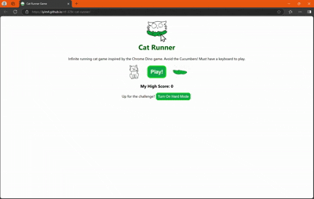

# Cat Runner

Visit [here!](https://iyim4.github.io/rtf-329c-cat-runner/)

## Project for RTF 329c, Specialization: VIDEO GAME DEVELOPER

An infinite runner adapted from [this tutorial](https://www.codinn.dev/projects/react-dinosaur-game) for the Chome Dino game

### Notes

While I didn't expect to use MS PowerPoint, of all things, it fit my needs. I appreciated the alignment features, which Procreate doesn't have.

Resources Used:
 * Software: VS Code, Powerpoint (for drawing), MS Copilot for adding features (for higher jump, different images, header), MS Clipchamp to convert images into gifs
 * Information: the above tutorial, MS Copilot

Total Time Spent on this project: 8.5 hours 

